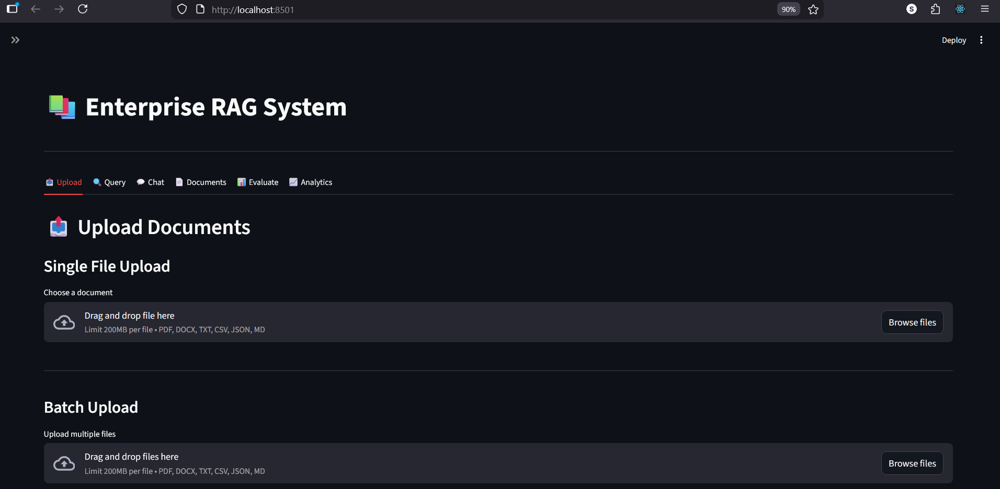
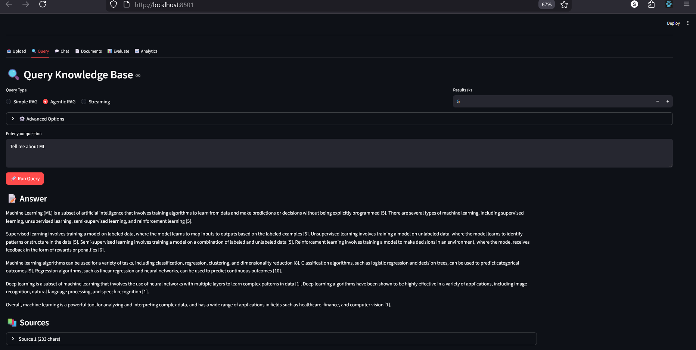
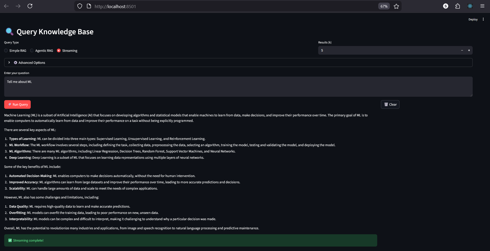

# 📚 Enterprise RAG System

A production-ready Retrieval-Augmented Generation (RAG) system with a modern Streamlit frontend and FastAPI backend. Built for enterprise-scale document processing, intelligent querying, and advanced analytics.



## 🌟 Features

### Core Capabilities
- **📤 Multi-Format Document Upload** - Support for PDF, DOCX, TXT, CSV, JSON, and MD files
- **🔍 Advanced Query System** - Simple RAG, Agentic RAG, and Streaming responses
- **💬 Multi-turn Chat** - Context-aware conversations with session management
- **📊 RAG Evaluation** - Built-in metrics for context relevance, faithfulness, and completeness
- **📈 Real-time Analytics** - Comprehensive system monitoring and performance tracking
- **🧠 Intelligent Caching** - Query result caching for faster responses
- **🎯 Smart Reranking** - Improved result relevance with reranking algorithms

### Advanced Features
- **Batch Upload** - Process multiple documents simultaneously
- **Session Management** - Isolated chat sessions with history tracking
- **Cache Management** - Manual cache clearing and optimization
- **Document Management** - View, track, and delete uploaded documents
- **Metrics Dashboard** - Real-time KPIs, cache hit rates, and error tracking
- **API Key Authentication** - Secure access control (optional)

## 🖼️ Screenshots

### Query Interface

*Advanced query interface with multiple RAG modes and customizable options*

### Analytics Dashboard

*Comprehensive analytics with performance metrics and system health monitoring*

### Chat Interface

*Multi-turn conversational interface with context-aware responses*

## 🚀 Quick Start

### Prerequisites
```bash
# Python 3.8 or higher
python --version

# Install dependencies
pip install -r requirements.txt
```

### Installation

1. **Clone the repository**
```bash
git clone https://github.com/yourusername/enterprise-rag-system.git
cd enterprise-rag-system
```

2. **Install dependencies**
```bash
pip install -r requirements.txt
```

3. **Start the backend**
```bash
python fullrag.py
```

4. **Start the frontend** (in a new terminal)
```bash
streamlit run fullragdeploy.py
```

5. **Access the application**
```
Frontend: http://localhost:8501
Backend API: http://localhost:8000
API Docs: http://localhost:8000/docs
```

## 📋 Requirements

```txt
streamlit>=1.28.0
requests>=2.31.0
fastapi>=0.104.0
uvicorn>=0.24.0
python-multipart>=0.0.6
langchain>=0.1.0
langchain-community>=0.0.10
chromadb>=0.4.18
sentence-transformers>=2.2.2
PyPDF2>=3.0.1
python-docx>=1.1.0
pandas>=2.0.0
```

## 🏗️ Project Structure

```
enterprise-rag-system/
│
├── enterprise_rag_frontend_complete.py   # Streamlit frontend
├── enterprise_rag_backend.py             # FastAPI backend (separate file)
├── requirements.txt                       # Python dependencies
├── README.md                             # This file
├── images/                               # Screenshots
│   ├── screenshot1.png
│   ├── screenshot2.png
│   ├── screenshot3.png
│   └── screenshot4.png
│
└── data/                                 # Auto-generated
    ├── uploads/                          # Uploaded documents
    └── vector_store/                     # ChromaDB storage
```

## 💡 Usage Guide

### 1. Upload Documents

**Single File Upload:**
- Navigate to the "📤 Upload" tab
- Select a file (PDF, DOCX, TXT, CSV, JSON, MD)
- Click "Upload File"

**Batch Upload:**
- Select multiple files using the batch uploader
- Review the file list
- Click "Upload Batch"

### 2. Query Your Documents

**Simple RAG:**
```
1. Go to "🔍 Query" tab
2. Select "Simple RAG" mode
3. Enter your question
4. Adjust k (number of results)
5. Click "🚀 Run Query"
```

**Agentic RAG:**
- Select "Agentic RAG" for complex queries
- View step-by-step reasoning process
- Get more comprehensive answers

**Streaming:**
- Select "Streaming" for real-time responses
- Watch answers generate word-by-word

### 3. Chat with Your Documents

```
1. Navigate to "💬 Chat" tab
2. Use the session ID to maintain context
3. Ask follow-up questions
4. Create new sessions as needed
```

### 4. Evaluate Performance

```
1. Go to "📊 Evaluate" tab
2. Enter a test query
3. Review evaluation metrics:
   - Context Relevance (1-5)
   - Faithfulness (1-5)
   - Answer Completeness (1-5)
   - Overall Score
```

### 5. Monitor Analytics

```
1. Access "📈 Analytics" tab
2. View key metrics:
   - Total requests and queries
   - Cache hit rate
   - Average query time
   - System uptime
   - Error rates
```

## 🔧 Configuration

### Backend Configuration

Edit `enterprise_rag_backend.py` to customize:

```python
# API Settings
API_PORT = 8000
API_HOST = "0.0.0.0"

# Upload Settings
UPLOAD_DIR = "data/uploads"
MAX_FILE_SIZE = 10 * 1024 * 1024  # 10MB

# Vector Store
VECTOR_STORE_DIR = "data/vector_store"
EMBEDDING_MODEL = "all-MiniLM-L6-v2"

# LLM Settings
LLM_MODEL = "gpt-3.5-turbo"  # or your preferred model
TEMPERATURE = 0.7
```

### Frontend Configuration

Edit `enterprise_rag_frontend_complete.py`:

```python
# Backend URL
API_BASE = "http://localhost:8000"

# Session Settings
DEFAULT_K = 5  # Number of retrieval results
CACHE_ENABLED = True
RERANKING_ENABLED = True
```

## 🔐 Authentication

### Enable API Key Authentication

1. **Backend:** Set required API keys
```python
VALID_API_KEYS = {"key1", "key2", "key3"}
```

2. **Frontend:** Enter API key in sidebar
```
⚙️ Configuration → 🔑 Authentication → Enter API Key
```

## 📊 API Endpoints

### Document Management
- `POST /upload-file` - Upload single document
- `POST /upload-batch` - Upload multiple documents
- `GET /documents` - List all documents
- `DELETE /documents/{filename}` - Delete document

### Query Endpoints
- `POST /query/simple` - Simple RAG query
- `POST /query/agentic` - Agentic RAG query
- `POST /query/stream` - Streaming query

### Chat
- `POST /chat` - Multi-turn chat
- `DELETE /chat/{session_id}` - Clear chat history

### System
- `GET /health` - Health check
- `GET /metrics` - System metrics
- `GET /config` - Configuration
- `POST /cache/clear` - Clear cache

### Evaluation
- `POST /evaluate` - Evaluate query quality

Full API documentation: `http://localhost:8000/docs`

## 🎯 Use Cases

- **📚 Document Q&A** - Query large document collections
- **🔍 Research Assistant** - Find relevant information across multiple sources
- **💼 Enterprise Knowledge Base** - Company-wide information retrieval
- **📖 Study Aid** - Interactive learning from textbooks and notes
- **📄 Report Analysis** - Extract insights from business reports
- **🗂️ Archive Search** - Navigate historical documents

## 🔍 Advanced Features

### Custom Query Optimization
```python
# Enable query optimization
optimize_query = True
use_reranking = True
k = 10  # Retrieve top 10 results
```

### Cache Management
- Automatic caching of query results
- Manual cache clearing via UI
- Cache hit rate monitoring

### Session Management
- Isolated chat sessions
- Session-based history tracking
- Easy session switching

## 🐛 Troubleshooting

### Backend Connection Failed
```bash
# Check if backend is running
curl http://localhost:8000/health

# Restart backend
python enterprise_rag_backend.py
```

### Import Errors
```bash
# Reinstall dependencies
pip install -r requirements.txt --force-reinstall
```

### Upload Failures
- Check file size limits
- Verify file format compatibility
- Review backend logs

### Slow Queries
- Reduce k value
- Enable caching
- Check system resources

## 🚧 Roadmap

- [ ] Support for more document formats (PPTX, XLSX)
- [ ] Multi-language support
- [ ] Advanced filtering and search
- [ ] User management system
- [ ] Custom embedding models
- [ ] Cloud deployment guides
- [ ] Docker containerization
- [ ] Kubernetes deployment
- [ ] Integration with external LLM providers
- [ ] Advanced visualization tools

## 🤝 Contributing

Contributions are welcome! Please feel free to submit a Pull Request.

1. Fork the repository
2. Create your feature branch (`git checkout -b feature/AmazingFeature`)
3. Commit your changes (`git commit -m 'Add some AmazingFeature'`)
4. Push to the branch (`git push origin feature/AmazingFeature`)
5. Open a Pull Request

## 📝 License

This project is licensed under the MIT License - see the [LICENSE](LICENSE) file for details.

## 👥 Authors

**Your Name**
- GitHub: (https://github.com/SAM2512DS)
- Email: samdatascience2024@gmail.com

## 🙏 Acknowledgments

- Built with [Streamlit](https://streamlit.io/)
- Powered by [LangChain](https://langchain.com/)
- Vector storage by [ChromaDB](https://www.trychroma.com/)
- Backend framework: [FastAPI](https://fastapi.tiangolo.com/)

## 📞 Support

For support, email samdatascience2024@gmail.com or open an issue in the GitHub repository.

## ⭐ Star History

If you find this project useful, please consider giving it a star!

---

**Made with ❤️ for the RAG community**
